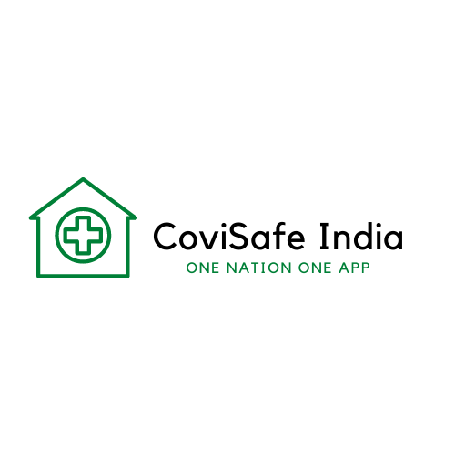

# CoviSafe-India Project

This is an app which will serve the frontend for the project **CoviSafeIndia**

## Functionalities

### Phase-1

For Initial phase we are planning to release only the fetch APIs for the users, in simple terms they will be able to get all the details which are available on server. All oxygen/blood/plasma/bed/ICU related details which are available in database.

We won't be adding functionalities for medicines/food/tests as of now, where medicine will be taken on priority in next phase.

- Features

1. Get oxygen supply details, user can filter according to city/oxygen requirement type (Concentrator, Empty Cylinder, Filled Cylinder)
2. Get Blood/Plasma details of individuals who are ready to donate, filter according to city, blood group type.
3. Get Hospital Bed count details, filter according to city, or requirement of normal/ICU bed type.

## Application Designs

Figma designs (not exact as in app) but have tried to keep application as similar as possible

## Contribution

All the volunteers are welcome to contribute to the issues open or create new issues.
I will try to be active in reviewing each one of them, all suggestions to improve existing functionalities are welcome too.
